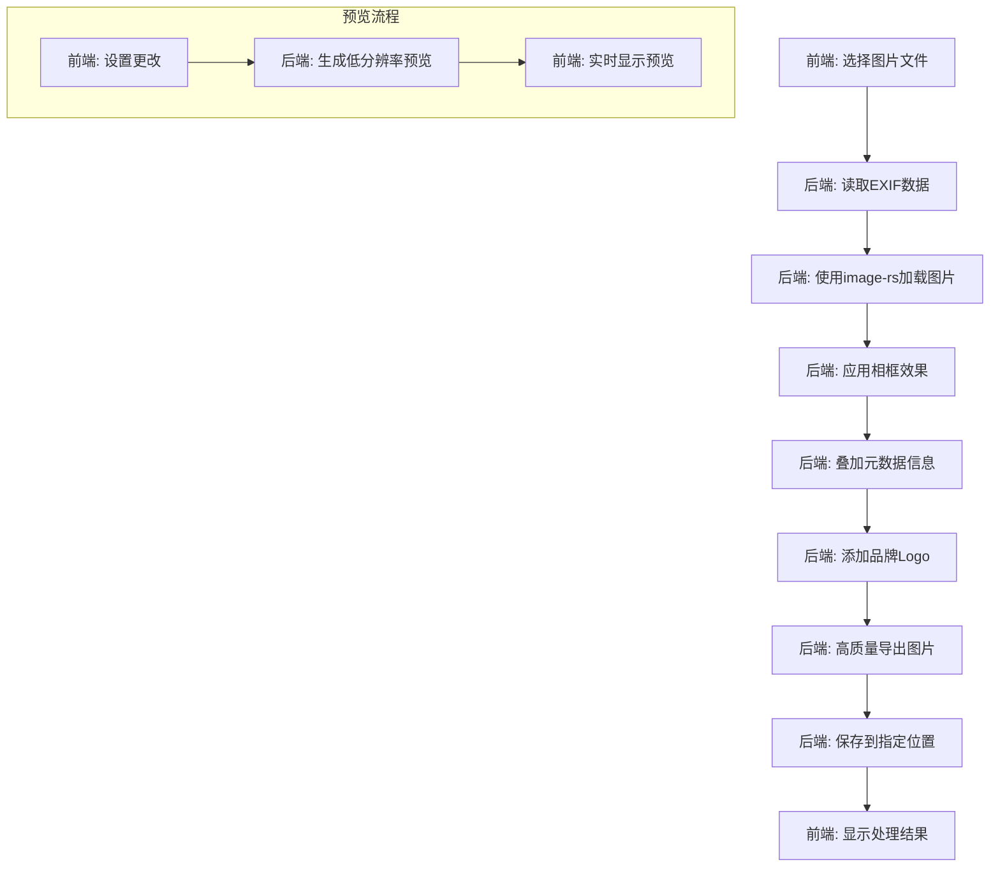

# Design Document

## Overview

照片元数据叠加工具是一个跨平台桌面应用程序，使用 Tauri + React 技术栈开发。应用程序将自动读取照片的EXIF数据，并在图片上叠加拍摄信息和装饰性相框，支持批量处理和高度自定义的样式设置。

## Architecture

### 技术栈选择
- **前端框架**: React + TypeScript
- **桌面框架**: Tauri (Rust后端 + Web前端)
- **UI组件库**: Ant Design (现代化设计语言)
- **图像处理**: Rust后端 - image-rs + imageproc + rusttype
- **前端预览**: HTML5 Canvas API (仅用于预览)
- **状态管理**: Zustand (轻量级状态管理)
- **样式**: Tailwind CSS + CSS Modules
- **动画**: Framer Motion (流畅的交互动画)
- **图标**: Lucide React (现代化图标库)

### 架构模式
采用前后端分离的分层架构模式：
- **前端表现层 (Frontend Presentation Layer)**: React组件、UI逻辑、预览功能
- **前端业务层 (Frontend Business Layer)**: 状态管理、用户交互、设置管理
- **Tauri通信层 (Tauri Communication Layer)**: 前后端通信桥梁
- **后端业务逻辑层 (Backend Business Logic Layer)**: 图像处理、EXIF解析、样式应用
- **后端数据访问层 (Backend Data Access Layer)**: 文件系统操作、图像I/O
- **平台层 (Platform Layer)**: 操作系统API和硬件资源

## Components and Interfaces

### 核心组件

#### 1. 主界面组件 (MainApp)
```typescript
interface MainAppProps {
  onFileSelect: (files: File[]) => void;
  onBatchProcess: () => void;
  processingStatus: ProcessingStatus;
}
```

#### 2. 文件选择器 (FileSelector)
```typescript
interface FileSelectorProps {
  onFilesSelected: (files: File[]) => void;
  supportedFormats: string[];
  allowMultiple: boolean;
  allowFolder: boolean;
}
```

#### 3. 预览组件 (ImagePreview)
```typescript
interface ImagePreviewProps {
  imageFile: File;
  overlaySettings: OverlaySettings;
  frameSettings: FrameSettings;
  onSettingsChange: (settings: any) => void;
}
```

#### 4. 设置面板 (SettingsPanel)
```typescript
interface SettingsPanelProps {
  overlaySettings: OverlaySettings;
  frameSettings: FrameSettings;
  onOverlayChange: (settings: OverlaySettings) => void;
  onFrameChange: (settings: FrameSettings) => void;
}
```

#### 5. 批量处理器 (BatchProcessor)
```typescript
interface BatchProcessorProps {
  files: File[];
  settings: ProcessingSettings;
  onProgress: (progress: ProcessProgress) => void;
  onComplete: (results: ProcessingResults) => void;
}
```

#### 6. 自定义布局编辑器 (CustomLayoutEditor)
```typescript
interface CustomLayoutEditorProps {
  imageFile: File;
  metadata: PhotoMetadata;
  customLayout: CustomLayoutSettings;
  onLayoutChange: (layout: CustomLayoutSettings) => void;
  onElementMove: (elementId: string, position: { x: number; y: number }) => void;
  onElementStyleChange: (elementId: string, style: Partial<MetadataElement['style']>) => void;
}

interface DraggableMetadataItemProps {
  element: MetadataElement;
  metadata: PhotoMetadata;
  imageSize: { width: number; height: number };
  onDragEnd: (position: { x: number; y: number }) => void;
  onStyleChange: (style: Partial<MetadataElement['style']>) => void;
  isSelected: boolean;
  onSelect: () => void;
}
```

### 服务接口

#### EXIF数据服务
```typescript
interface ExifService {
  extractMetadata(file: File): Promise<PhotoMetadata>;
  validateImageFile(file: File): boolean;
}

interface PhotoMetadata {
  camera: {
    make: string;
    model: string;
  };
  settings: {
    aperture: string;
    shutterSpeed: string;
    iso: number;
    focalLength: string;
  };
  timestamp: Date;
  location?: {
    latitude: number;
    longitude: number;
    address?: string;
  };
}
```

#### 图像处理服务 (后端Rust)
```rust
// Rust后端服务接口
pub struct ImageProcessingService;

impl ImageProcessingService {
    pub async fn process_image(
        image_path: &str,
        metadata: PhotoMetadata,
        overlay_settings: OverlaySettings,
        frame_settings: FrameSettings,
        output_path: &str,
        quality: u8
    ) -> Result<ProcessedImageInfo, ProcessingError>;
    
    pub async fn batch_process_images(
        image_paths: Vec<String>,
        settings: ProcessingSettings
    ) -> Result<BatchProcessingResult, ProcessingError>;
    
    pub async fn generate_preview(
        image_path: &str,
        settings: PreviewSettings
    ) -> Result<Vec<u8>, ProcessingError>; // 返回缩略图字节数据
}
```

#### 前端图像服务 (完整处理)
```typescript
interface FrontendImageService {
  loadImage(file: File): Promise<HTMLImageElement>;
  applyOverlay(
    image: HTMLImageElement,
    metadata: PhotoMetadata,
    settings: OverlaySettings
  ): Promise<HTMLCanvasElement>; // 支持预设和自定义布局
  
  applyFrame(
    canvas: HTMLCanvasElement,
    frameSettings: FrameSettings
  ): Promise<HTMLCanvasElement>;
  
  exportImage(
    canvas: HTMLCanvasElement,
    format: 'jpeg' | 'png',
    quality?: number
  ): Promise<Blob>; // 高质量导出
}
```

#### 品牌Logo服务
```typescript
interface BrandLogoService {
  getLogoByBrand(brand: string): Promise<HTMLImageElement | null>;
  getSupportedBrands(): string[];
}
```

## Data Models

### 叠加设置模型
```typescript
interface OverlaySettings {
  layoutMode: 'preset' | 'custom';
  position: 'top-left' | 'top-right' | 'bottom-left' | 'bottom-right'; // 预设模式使用
  customLayout?: CustomLayoutSettings; // 自定义模式使用
  font: {
    family: string;
    size: number;
    color: string;
    weight: 'normal' | 'bold';
  };
  background: {
    color: string;
    opacity: number;
    padding: number;
    borderRadius: number;
  };
  displayItems: {
    brand: boolean;
    model: boolean;
    aperture: boolean;
    shutterSpeed: boolean;
    iso: boolean;
    timestamp: boolean;
    location: boolean;
    brandLogo: boolean;
  };
}

interface CustomLayoutSettings {
  elements: MetadataElement[];
  gridEnabled: boolean;
  gridSize: number;
  snapToGrid: boolean;
}

interface MetadataElement {
  id: string;
  type: 'brand' | 'model' | 'aperture' | 'shutterSpeed' | 'iso' | 'timestamp' | 'location' | 'brandLogo';
  position: {
    x: number; // 相对于图片的百分比位置 (0-100)
    y: number; // 相对于图片的百分比位置 (0-100)
  };
  visible: boolean;
  style?: {
    fontSize?: number;
    color?: string;
    backgroundColor?: string;
    padding?: number;
  };
}
```

### 相框设置模型
```typescript
interface FrameSettings {
  enabled: boolean;
  style: 'simple' | 'shadow' | 'film' | 'polaroid' | 'vintage';
  color: string;
  width: number;
  opacity: number;
  customProperties?: {
    shadowBlur?: number;
    shadowOffset?: { x: number; y: number };
    cornerRadius?: number;
  };
}
```

### 处理状态模型
```typescript
interface ProcessingStatus {
  isProcessing: boolean;
  currentFile?: string;
  progress: number;
  totalFiles: number;
  completedFiles: number;
  errors: ProcessingError[];
}

interface ProcessingError {
  fileName: string;
  error: string;
  timestamp: Date;
}
```

## Error Handling

### 错误分类
1. **文件访问错误**: 文件不存在、权限不足、格式不支持
2. **EXIF解析错误**: 文件损坏、缺少EXIF数据
3. **图像处理错误**: 内存不足、处理超时
4. **导出错误**: 磁盘空间不足、写入权限问题

### 错误处理策略
```typescript
class ErrorHandler {
  static handleFileError(error: FileError): UserFriendlyMessage {
    switch (error.type) {
      case 'ACCESS_DENIED':
        return { message: '无法访问文件，请检查文件权限', severity: 'error' };
      case 'UNSUPPORTED_FORMAT':
        return { message: '不支持的文件格式', severity: 'warning' };
      case 'FILE_NOT_FOUND':
        return { message: '文件不存在', severity: 'error' };
      default:
        return { message: '文件处理出错', severity: 'error' };
    }
  }
  
  static handleProcessingError(error: ProcessingError): void {
    // 记录错误日志
    console.error(`Processing error for ${error.fileName}:`, error.error);
    
    // 继续处理其他文件，不中断批量操作
    // 在结果摘要中显示错误信息
  }
}
```

## Testing Strategy

### 单元测试
- **EXIF解析测试**: 使用各种相机品牌的样本照片测试元数据提取
- **图像处理测试**: 测试叠加和相框功能的正确性
- **设置管理测试**: 测试用户设置的保存和加载
- **错误处理测试**: 测试各种异常情况的处理

### 集成测试
- **端到端流程测试**: 从文件选择到最终导出的完整流程
- **批量处理测试**: 测试大量文件的处理性能和稳定性
- **跨平台兼容性测试**: 在Windows、macOS、Linux上测试功能一致性

### 性能测试
- **内存使用测试**: 确保大文件处理时不会内存溢出
- **处理速度测试**: 优化图像处理算法的性能
- **并发处理测试**: 测试批量处理的并发能力

### 用户体验测试
- **界面响应性测试**: 确保UI在处理过程中保持响应
- **预览实时性测试**: 测试设置更改时预览的实时更新
- **错误提示测试**: 确保错误信息对用户友好且有帮助

## 用户界面设计

### 现代化设计原则
- **简洁性**: 采用极简设计风格，减少视觉噪音，突出核心功能
- **一致性**: 统一的颜色方案、字体和交互模式
- **响应性**: 流畅的动画和即时反馈，提升用户体验
- **可访问性**: 支持键盘导航和屏幕阅读器

### 界面布局设计
```
┌─────────────────────────────────────────────────────────────┐
│  [Logo] Photo Metadata Overlay        [最小化] [最大化] [关闭] │
├─────────────────────────────────────────────────────────────┤
│  [文件] [编辑] [视图] [帮助]                                    │
├─────────────────┬───────────────────────────────────────────┤
│                 │                                           │
│   设置面板       │              预览区域                      │
│                 │                                           │
│ ┌─────────────┐ │  ┌─────────────────────────────────────┐  │
│ │ 叠加设置    │ │  │                                     │  │
│ │ • 位置      │ │  │         图片预览                     │  │
│ │ • 字体      │ │  │                                     │  │
│ │ • 颜色      │ │  │                                     │  │
│ │ • 透明度    │ │  │                                     │  │
│ └─────────────┘ │  └─────────────────────────────────────┘  │
│                 │                                           │
│ ┌─────────────┐ │  ┌─────────────────────────────────────┐  │
│ │ 相框设置    │ │  │        操作按钮区                    │  │
│ │ • 样式      │ │  │  [选择文件] [批量处理] [导出设置]    │  │
│ │ • 颜色      │ │  └─────────────────────────────────────┘  │
│ │ • 宽度      │ │                                           │
│ └─────────────┘ │                                           │
│                 │                                           │
├─────────────────┴───────────────────────────────────────────┤
│  状态栏: 就绪 | 已选择 3 个文件 | 处理进度: 0/0               │
└─────────────────────────────────────────────────────────────┘
```

### 操作流程设计
1. **直观的文件选择**: 支持拖拽、点击选择、文件夹批量选择
2. **实时预览**: 设置更改时立即显示效果，无需等待
3. **渐进式设置**: 从基础设置到高级自定义，分层展示
4. **一键操作**: 常用功能提供快捷按钮和键盘快捷键

### 视觉设计规范
```typescript
// 设计系统配置
const DesignSystem = {
  colors: {
    primary: '#1890ff',      // 主色调 - 现代蓝
    secondary: '#52c41a',    // 辅助色 - 成功绿
    accent: '#722ed1',       // 强调色 - 紫色
    neutral: {
      50: '#fafafa',
      100: '#f5f5f5',
      200: '#e8e8e8',
      300: '#d9d9d9',
      500: '#8c8c8c',
      700: '#434343',
      900: '#262626'
    }
  },
  typography: {
    fontFamily: {
      sans: ['Inter', 'system-ui', 'sans-serif'],
      mono: ['JetBrains Mono', 'monospace']
    },
    fontSize: {
      xs: '12px',
      sm: '14px',
      base: '16px',
      lg: '18px',
      xl: '20px',
      '2xl': '24px'
    }
  },
  spacing: {
    xs: '4px',
    sm: '8px',
    md: '16px',
    lg: '24px',
    xl: '32px'
  },
  borderRadius: {
    sm: '4px',
    md: '8px',
    lg: '12px',
    full: '50%'
  },
  shadows: {
    sm: '0 1px 2px rgba(0, 0, 0, 0.05)',
    md: '0 4px 6px rgba(0, 0, 0, 0.07)',
    lg: '0 10px 15px rgba(0, 0, 0, 0.1)'
  }
};
```

### 交互动画设计
```typescript
// 动画配置
const AnimationConfig = {
  transitions: {
    fast: '150ms ease-out',
    normal: '250ms ease-out',
    slow: '350ms ease-out'
  },
  hover: {
    scale: 1.02,
    transition: 'transform 150ms ease-out'
  },
  loading: {
    spinner: 'rotate 1s linear infinite',
    pulse: 'pulse 2s cubic-bezier(0.4, 0, 0.6, 1) infinite'
  }
};
```

## 实现细节

### 图像处理流程


### 用户体验优化
- **智能预设**: 提供摄影师常用的样式预设模板
- **快捷操作**: 支持键盘快捷键和右键菜单
- **批量预览**: 批量处理前可预览所有文件的效果
- **撤销重做**: 支持操作历史记录和撤销功能
- **自动保存**: 定期保存用户设置和工作进度

### 设置持久化
使用Tauri的存储API将用户设置保存到本地配置文件中，确保应用重启后设置得以保留。

### 品牌Logo管理
内置常见相机品牌的Logo资源，使用SVG格式确保在不同分辨率下的清晰度。支持的品牌包括：Canon、Nikon、Sony、Fujifilm、Olympus、Panasonic、Leica等。